# ProtBind Agent workflow

The diagram shows the proposed ESMFold-v1-first workflow. Vina is the required pose path;
protein–ligand cofolding is optional evidence and cannot block a docking-only report.

```mermaid
flowchart TD
    user["Researcher<br/>target, hypothesis, mode, privacy policy"]
    interface["Local CLI / Web UI / HipFire planner<br/>restricted tools; no arbitrary shell or network"]
    orchestrator["Deterministic ProtBind orchestrator<br/>seeded execution, policy gates, resume"]
    manifest[("ArtifactStore + RunManifest<br/>SHA-256 lineage and stage cache")]

    user --> interface
    interface --> orchestrator
    orchestrator -. "read/write receipts" .-> manifest

    subgraph input_phase["1. Case and input gates"]
        case["ResearchCase<br/>both / ligand_only / pocket_only"]
        preflight{"Local preflight passes?"}
        hard_fail["FAILED<br/>invalid identity, unsupported chemistry,<br/>corrupt provenance"]
        case --> preflight
        preflight -->|"no"| hard_fail
    end

    orchestrator --> case

    subgraph receptor_phase["2. Receptor resolver — first valid source wins"]
        resolver["User structure → exact local cache →<br/>explicitly approved RCSB"]
        source_ready{"Validated receptor found?"}
        fold["ESMFold v1 receptor prediction<br/>offline, one GPU, hash-attested"]
        fold_ready{"ESMFold receptor available?"}
        structure_qc["Gemmi structural QC<br/>sequence, N/CA/C, finite coordinates,<br/>altloc, metal and covalent-link gates"]
        fold_note["Receptor-only output<br/>never a ligand pose or cofold result"]
        resolver --> source_ready
        source_ready -->|"yes"| structure_qc
        source_ready -->|"no"| fold --> fold_ready
        fold -. "scientific scope" .-> fold_note
        fold_ready -->|"yes"| structure_qc
    end

    preflight -->|"yes"| resolver
    fold_ready -->|"no capability"| degraded
    structure_qc -->|"hard invalid"| hard_fail

    subgraph query_phase["3. Mode-specific pharmacophore query"]
        mode{"Research mode"}
        both["both<br/>ligand branch + pocket branch"]
        ligand_only["ligand_only<br/>ligand query + candidate pocket boxes"]
        pocket_only["pocket_only<br/>complementary pocket query"]
        rrf["Equal-weight RRF<br/>preserve both branch rankings"]
        one_branch["Single-branch deterministic ranking"]
        mode -->|"both"| both
        mode -->|"ligand_only"| ligand_only
        mode -->|"pocket_only"| pocket_only
        both --> rrf
        ligand_only --> one_branch
        pocket_only --> one_branch
    end

    structure_qc -->|"valid"| mode

    subgraph funnel_phase["4–5. Screening and deterministic selection"]
        index["Frozen chemical index<br/>standard parent + conformers + triangles"]
        tripharm["TriPharm CPU/HIP<br/>geometric score only → top 512"]
        diversity["Bemis–Murcko diversity<br/>top 128 scaffolds"]
        microstates["Enumerate ≤4 microstates / molecule"]
        quick_vina["Quick CPU Vina<br/>≤2 microstates / molecule"]
        select["Select top 16 for evidence docking<br/>top 8 eligible for optional cofold"]
        index --> tripharm
        rrf --> tripharm
        one_branch --> tripharm
        tripharm --> diversity --> microstates --> quick_vina --> select
    end

    subgraph pose_phase["6. Pose evidence — docking-first"]
        evidence_vina["Required evidence-grade Vina<br/>receptor + box + seed + pose + tool score"]
        cofold_gate{"OpenFold3 checkpoint/runtime gate passes?"}
        openfold["Optional OpenFold3 top 8<br/>one GPU, low_mem, one sample, offline"]
        no_cofold["Complex prediction unavailable<br/>record reason; do not block docking path"]
        pose_bundle["Typed pose ensemble<br/>Vina required; cofold optional"]
        select --> evidence_vina --> pose_bundle
        select -. "optional" .-> cofold_gate
        cofold_gate -->|"yes"| openfold --> pose_bundle
        cofold_gate -->|"no"| no_cofold --> pose_bundle
    end

    subgraph validation_phase["7. Multi-evidence validation"]
        identity_gate["Chemical identity and PoseBusters hard gate"]
        rejected["REJECTED<br/>identity, collision, strain or geometry failure"]
        rmsd["sPyRMSD only with an authorized reference pose"]
        ifp["ProLIF interaction fingerprints<br/>and Vina/cofold consensus when available"]
        openmm["Optional OpenMM local minimization gate<br/>only for parameterized supported systems"]
        classify["Evidence grade<br/>REFERENCE_SUPPORTED / CONSENSUS_SUPPORTED /<br/>HYPOTHESIS_ONLY / REJECTED"]
        pose_bundle --> identity_gate
        identity_gate -->|"invalid"| rejected
        identity_gate -->|"valid"| rmsd --> ifp --> openmm --> classify
        rejected --> classify
    end

    subgraph report_phase["8. Evidence and local research interface"]
        report["Deterministic Markdown + HTML report<br/>top 5, caveats, artifact citations"]
        seekdb[("seekdb<br/>authoritative cases, jobs, evidence, document chunks")]
        memory["PowerMem optional<br/>preferences and failure lessons only"]
        rag["Local cited RAG / HipFire narrative<br/>no invented scientific values"]
        classify --> report
        report --> seekdb
        seekdb --> rag
        memory -. "artifact-backed hints" .-> rag
    end

    degraded["DEGRADED<br/>recoverable missing tool, OOM or worker crash<br/>preserve completed artifacts and resume"]
    degraded -->|"capability restored"| orchestrator

    classDef verified fill:#DCFCE7,stroke:#15803D,color:#14532D,stroke-width:2px;
    classDef deterministic fill:#DBEAFE,stroke:#2563EB,color:#1E3A8A,stroke-width:2px;
    classDef optional fill:#F3E8FF,stroke:#7C3AED,color:#581C87,stroke-width:2px;
    classDef pending fill:#FEF3C7,stroke:#D97706,color:#78350F,stroke-width:2px;
    classDef terminal fill:#FEE2E2,stroke:#DC2626,color:#7F1D1D,stroke-width:2px;
    classDef store fill:#FFEDD5,stroke:#EA580C,color:#7C2D12,stroke-width:2px;

    class preflight,resolver,fold,structure_qc,index,tripharm,report verified;
    class case,orchestrator,source_ready,fold_ready,mode,rrf,one_branch,evidence_vina,identity_gate,rmsd,ifp,classify deterministic;
    class fold_note,cofold_gate,openfold,no_cofold,openmm,memory,rag optional;
    class ligand_only,diversity,microstates,quick_vina,select,pose_bundle pending;
    class hard_fail,degraded,rejected terminal;
    class manifest,seekdb store;
```

