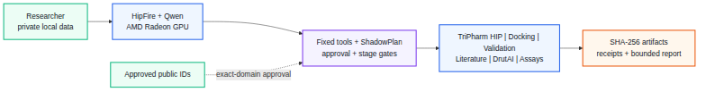

% ProtBind
% A Local-Private Protein–Ligand Research Agent on AMD Radeon
% AMD AI DevMaster Hackathon — Track 2

# The problem

- Protein–ligand research combines private sequences, compounds, papers, screening, docking and
  wet-lab measurements.
- General chat Agents may leak data, lose state, and turn plausible prose into false evidence.
- Small laboratories need a local workstation product, not another cloud-only wrapper.

# Our solution

- Local HipFire + Qwen Agent on AMD Radeon
- Fixed scientific tools instead of arbitrary shell access
- Per-tool approval and nonblocking ShadowPlan resume
- Hash-bound stages, receipts and evidence-bounded reports
- Screening-to-experiment data substrate

# Architecture

# What the Agent can do

- Resolve and validate receptor inputs
- Search a local pharmacophore index
- Select diverse candidates and generate Vina poses
- Apply PoseBusters, RMSD and ProLIF checks
- Retrieve local literature with artifact/page citations
- Import assay tables and run explicit deterministic fits
- Preserve failures and resumable scientific state

# AMD Radeon and ROCm

- Formal W7900/gfx1100 Agent receipt
- 3/3 required tool sequences and citations passed
- 16.552 s p50 end-to-end latency
- 33.139 p50 end-to-end model tokens/s
- 7.271 GB observed peak VRAM
- TriPharm ROCm HIP prefilter with exact CPU parity

# Honest science

- Latest controlled redocking revision: 9/10 on the same observed fixed-ten set
- Frozen three-target pharmacophore result is target-dependent
- No broad superiority over Pharmer claim
- No affinity claim from Vina or DrutAI
- No end-to-end speedup claim while CPU finalization dominates

# Privacy and safety

- Private data stays local
- No generic shell, arbitrary URL, or open-network Agent tool
- Every sensitive read/write requires fresh approval
- One-time scientific continuation tokens
- Optional Snap workers must be strict-confined with no network interface

# Product path

- Today: local Agent, screening, docking, validation, literature, assay import
- Next: resident-GPU exact finalizer, fpocket/P2Rank consensus, specialized assay analysis
- Cross-verification: W7900/gfx1100 to R9700/gfx1201
- Goal: an auditable private research workstation that learns from real experiments
