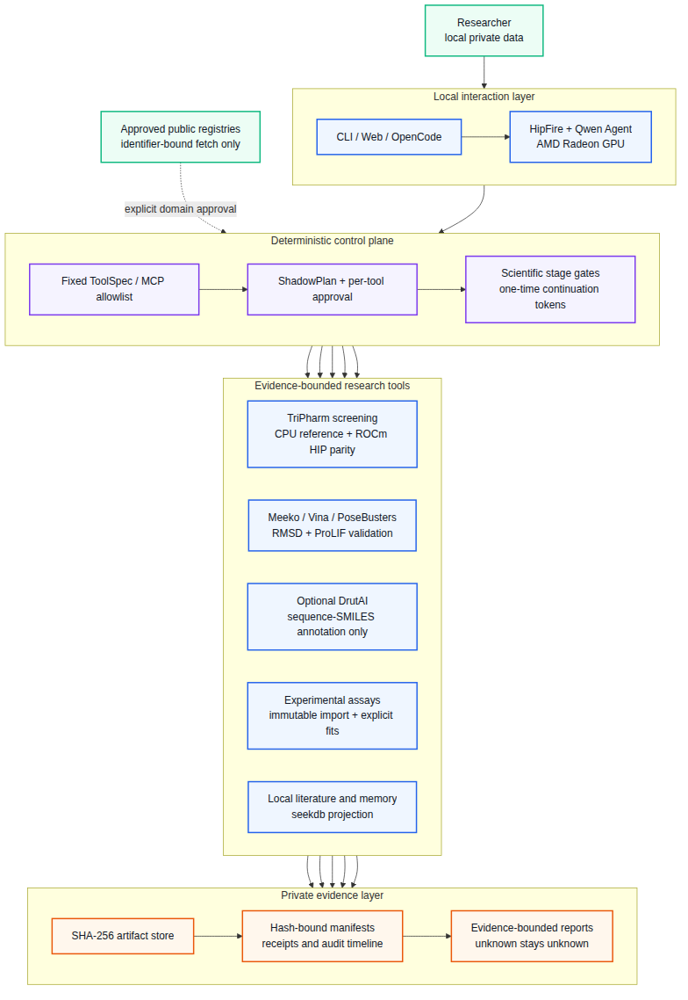

# Executive summary

ProtBind is a local-private Agent for protein–ligand research. It combines a locally served Qwen
model, deterministic permissions, scientific stage gates, pharmacophore screening, docking,
pose-quality checks, literature retrieval, experimental-data ingestion, and evidence-bounded
reporting. Private protein sequences, compound structures, assay measurements, and execution
traces remain on the user's workstation.

The central product decision is to separate language reasoning from scientific state. The LLM may
propose and explain actions, but it cannot create a docking score, mark a stage complete, approve
its own access to private data, or convert a model prediction into experimental evidence. Every
scientific transition is decided by deterministic code and content-addressed receipts.

# Application scenario and users

## Problem

Biologists and medicinal chemists routinely combine structures, compound libraries, docking,
papers, and wet-lab measurements. Existing general-purpose assistants create three risks:

1. confidential sequences or compounds may leave the workstation;
2. generated prose may be confused with computed or experimental evidence;
3. long workflows lose state, provenance, failed conditions, and human decisions.

## Target users

- academic and industrial protein–ligand researchers;
- medicinal chemists triaging compounds before experiments;
- computational biologists who need reproducible local workflows;
- small laboratories that cannot deploy a large cloud platform.

## Typical workflow

The researcher creates a case, approves specific private-data reads, screens a local compound
library, selects chemically diverse candidates, generates docking poses, applies pose-quality
gates, inspects an evidence-bounded report, and later imports experimental measurements. Failed
stages remain explicit and resumable instead of being replaced by plausible-looking text.

# System architecture

{width=62%}

The implementation has four separable layers:

1. **Interaction.** CLI, local Web UI, OpenCode, or the built-in Agent communicate with a local
   HipFire endpoint. No closed online API is required for the core workflow.
2. **Control.** A fixed ToolSpec/MCP allowlist, ShadowPlan previews, per-tool approval, scientific
   stage gates, and one-time continuation tokens prevent arbitrary execution and confused-deputy
   behavior.
3. **Scientific tools.** TriPharm screening, Meeko/Vina docking, PoseBusters, symmetry-aware RMSD,
   ProLIF, optional DrutAI annotation, immutable assay import, curve fitting, and local retrieval
   operate behind typed contracts.
4. **Evidence.** SHA-256 artifacts, hash-bound manifests, acceptance receipts, and audit timelines
   are the only source of scientific state. Reports cite artifacts and preserve unknowns.

# Core Agent capabilities

## Local inference and tool use

HipFire serves Qwen3.5-9B locally on Radeon. ProtBind aggregates streamed tool-call fragments,
routes only relevant schemas into a turn, and verifies the required tool sequence. The same typed
service is exposed to the built-in Agent and the local MCP integration.

## ShadowPlan and approval-safe resume

Sensitive calls enter `WAITING_APPROVAL` without returning a fake failure to the model. The UI
shows a redacted ShadowPlan describing possible actions, state effects, recovery, and privacy
impact. Approval IDs, scientific continuation tokens, and plan IDs are distinct and single-use.
After approval, ProtBind rechecks the current manifest and policy before dispatch.

## Stage-gated science

The main state machine is:

```text
CREATED -> INPUT_VALIDATED -> RECEPTOR_READY -> INDEXED -> SCREENED
        -> SELECTED -> DOCKED -> VALIDATED -> REPORTED
```

Each step has a deterministic preflight and postflight. Missing tools, unsupported chemistry,
invalid geometry, changed artifacts, stale tokens, and worker failures stop or degrade the run
with an explicit reason.

## Private knowledge and memory

The local knowledge layer supports page-aware literature import and retrieval. Scientific state
remains in immutable artifacts; seekdb is used as a retrieval projection rather than an authority
that may silently overwrite a result. Experience memory records audited failures, toolchains, and
reusable preferences without copying a prior scientific conclusion into a new case.

## Experimental-data substrate

Co-IP/Western, CETSA, SPR, BLI, enzyme-activity, and cellular-response tables can be previewed and
then imported after a second approval. Raw and canonical records are immutable. The first release
supports explicitly selected four-parameter logistic and one-site binding fits; fit quality does
not prove direct binding or mechanism.

## Optional DrutAI annotation

DrutAI consumes protein sequences and SMILES, not pockets or poses. It is therefore an optional
sequence–SMILES concordance annotation, never a hard filter or binding verifier. ProtBind does not
redistribute the third-party weights. Weight acquisition is commit-pinned and hash-checked with an
explicit GPL acknowledgement. A strict-confined Snap worker must have no connected network
interface; otherwise the call fails closed.

# AMD Radeon and ROCm implementation

## Local Agent inference

The formal W7900 receipt binds the GPU architecture, model bytes, HipFire revision, running daemon,
loaded HIP runtime, prompt suite, tool results, and memory samples. One warm-up and three measured
runs produced:

| Metric | Result |
|---|---:|
| Required tool-sequence pass rate | 1.000 |
| Tool success rate | 1.000 |
| Artifact-citation pass rate | 1.000 |
| End-to-end latency p50 / p95 | 16.552 / 16.692 s |
| First-model TTFT p50 / p95 | 9.605 / 9.707 s |
| End-to-end model throughput p50 / p95 | 33.139 / 37.138 tokens/s |
| Observed peak Radeon VRAM | 7,271,006,208 bytes |

Evidence: `experiment-results/protbind-agent-w7900-c58ca3c.json`, file SHA-256
`8b3f16fd63e54ac4d158d8945095ee9a2181a0e0ce43195f470e828a0ddd9ab6`.

## TriPharm HIP screening

TriPharm performs a geometric pharmacophore search. Its ROCm HIP lane generates a candidate mask;
the current production-safe path uses the CPU reference for exact final ranking and commits HIP
only when the complete ranked molecule-ID order is identical.

On the frozen ALDH1, MAPK1, and MTORC1 validation runs, CPU/HIP complete-score parity passed for all
three targets. Static HIP prefilter measurements on GPU1, a Radeon Pro W7900 (`gfx1100`), used five
warm-ups and 30 measured repetitions:

| Target | Queries | Static index | Process p50 | Kernel p50 |
|---|---:|---:|---:|---:|
| MAPK1 | 4 | 144.5 MB | 0.2575 s | 0.01057 s |
| MTORC1 | 16 | 132.0 MB | 0.2794 s | 0.03801 s |
| ALDH1 | 16 | 252.5 MB | 0.3945 s | 0.06638 s |

These timings exclude the CPU exact finalizer. They demonstrate a fast, exact Radeon prefilter,
not end-to-end application acceleration. The current finalizer dominates full workflow time, so
an end-to-end speedup claim would be false.

# Scientific validation and bounded claims

## Docking protocol validation

The original result-blind fixed-ten redocking baseline recovered 7/10 complexes. Two controlled
protocol revisions were rerun on the same already-observed cases. The latest constrained
side-chain repair completed 10/10 and recovered 9/10 at top-1/top-5, with real Meeko/RDKit,
PoseBusters, symmetry-aware RMSD, and ProLIF evaluation.

This 9/10 result is controlled revision evidence, not a prospective generalization estimate. Vina
scores are not experimental affinity, and interaction-fingerprint agreement is not proof of
binding.

## Pharmacophore comparison

Pharmer is used as an independent CPU scientific baseline. The frozen train-only three-target
evaluation found target-dependent enrichment: TriPharm outperformed Pharmer on some metrics and
targets, while Pharmer performed better on ALDH1 EF1%. The frozen competition-strength gate failed
because median TriPharm EF1% was below 2. Broad superiority is not claimed.

# Privacy and security design

- Core inference and private-data processing are local.
- The Agent has no generic shell, filesystem, arbitrary URL, or open-network tool.
- Every private data access requires a fresh host confirmation.
- Public acquisition is identifier-bound and exact-domain approved.
- Private outputs are content-addressed and path-redacted at the Agent boundary.
- Tool output identity, order, finite numeric ranges, and artifact closure are validated.
- Sensitive multi-tool turns pause and approve each call separately.
- Snap or bubblewrap network isolation is attested before optional private worker execution.

# Local deployment plan

The validated development host uses two Radeon Pro W7900 GPUs. GPU0 is the scientific-compute lane;
GPU1 is reserved for HipFire and interactive inference. Single-GPU machines time-slice the local
LLM and scientific GPU jobs. Future R9700 (`gfx1201`) execution is a cross-architecture verifier and
is not included in current performance claims.

The reproducible environment uses an AIAA Conda base with a small inherited overlay, pinned lock
files, an exact Vina binary hash, CMake/HIP compilation, and runtime doctor receipts. See
`submission/REPRODUCIBILITY.md`.

# Innovation and practical value

ProtBind's contribution is not another chat wrapper. It combines:

- a local Radeon Agent with measured tool-call completion;
- approval-safe, nonblocking Agent resume;
- deterministic scientific state separated from LLM text;
- auditable CPU/HIP parity rather than unchecked GPU output;
- honest negative results and explicit claim boundaries;
- a path from computational screening to structured wet-lab measurements.

This makes the system useful as a private research workstation today while preserving a clear path
to cross-architecture validation, resident-GPU screening, specialized assay analysis, and active
learning.

# Known limitations

- The current TriPharm CPU exact finalizer prevents an end-to-end screening speedup claim.
- The revised 9/10 docking protocol needs a new result-blind external set for generalization.
- fpocket/P2Rank automatic consensus is not yet in the main ligand-only workflow.
- Cross-process approval persistence, Web approval timelines, and controlled approval-delay
  benchmarks remain future work.
- Specialized Co-IP image quantification, CETSA thermal models, SPR kinetics, mixed-effects
  inter-laboratory analysis, and active learning are not implemented in this release.
- R9700/gfx1201 cross-verification has not yet been run.
